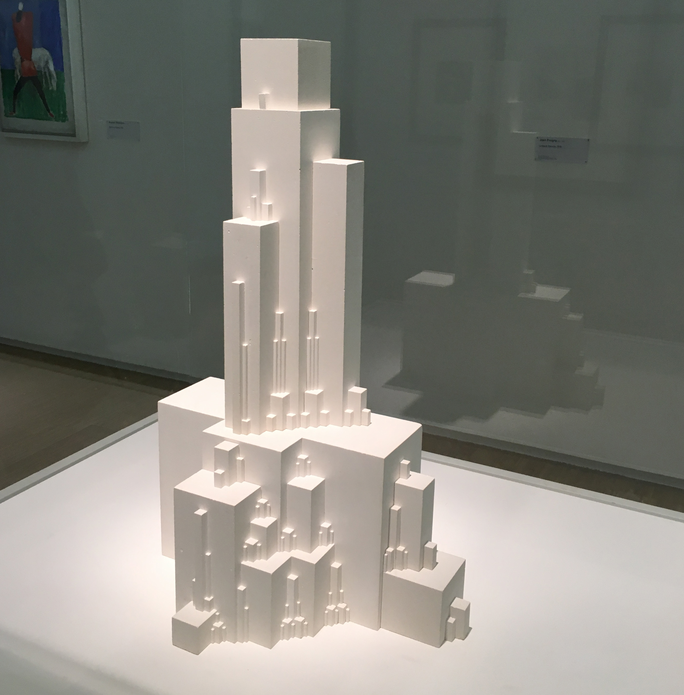

 

##### Language [EN](README.md) | [DE](README_DE.md) Sprache

# 11790 | Decode - Digital Design
This repository contains the code used in the basic course for Python and Processing.

## Course Brief
The module deals with digital form finding and the reconstruction of artistic works using algorithms. During the course the participants learn various programming methods, for the purpose of 3d sculpture creation. In addition to the learning of programming basics, the goal of the course is to introduce the broad topic of design by code.

Basic knowledge in programming is an advantage, but the module is suitable for absolute beginners. Work is done mainly with the programming language PYTHON in the program Rhino 3D. After several classes the participants will be able to independently program their own interactive creations on a specific topic.
