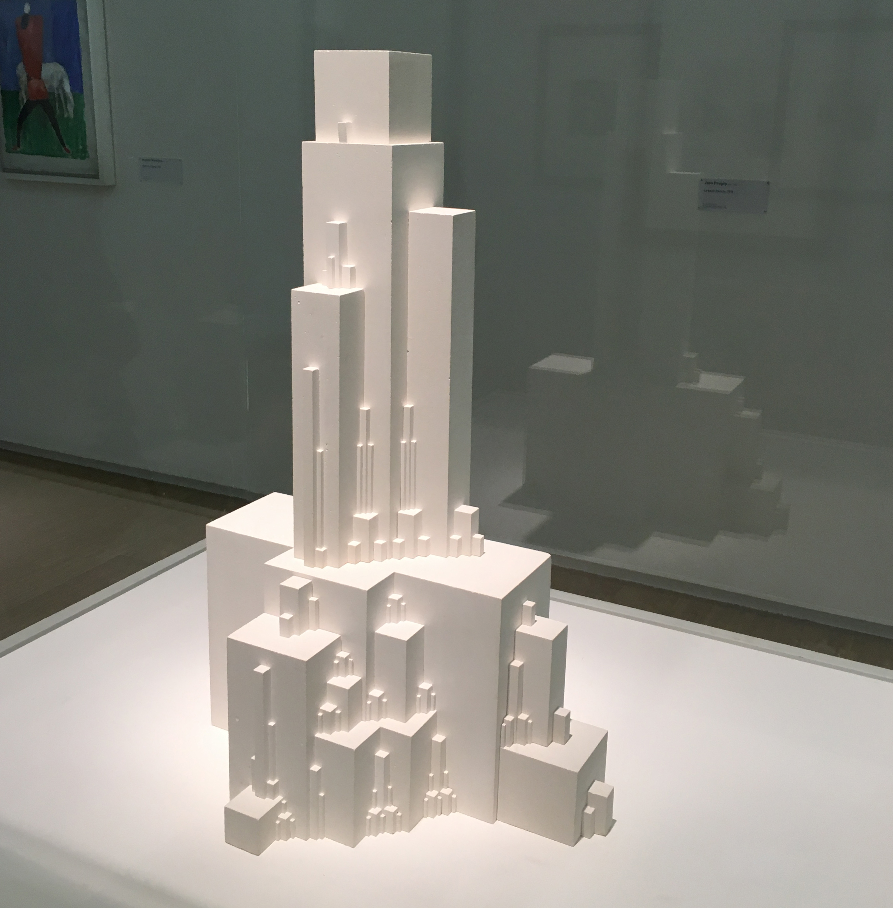

 

##### Language [EN](README.md) | [DE](README_DE.md) Sprache 

# 11790 | Decode - Digitales Entwerfen
Dieses Repository enthält den Code, der im Grundkurs für Python und Processing verwendet wird.

## Thema
Das Modul beschäftigt sich mit digitaler Formfindung und der Rekonstruktion künstlerischer Werke mittels Software-Algorithmen. Es werden verschiedene Programmiermethoden vermittelt, mit welchen es möglich wird, eine 3D Skulptur zu erzeugen. Das Ziel des Moduls ist es, neben dem Erlernen von Programmiergrundlagen, auch die Heranführung an das breite Themenfeld der Gestaltung durch Code.

Auch wenn Grundkenntnisse in Programmieren vom Vorteil sind, ist das Modul auch für Anfänger geeignet. Gearbeitet wird vor allem mit der Programmiersprache PYTHON im Programm Rhino 3D. In mehreren Kursen werden die Teilnehmer in der Lage sein, selbständig eigene interaktive Kreationen zu einem bestimmten Thema zu programmieren.
